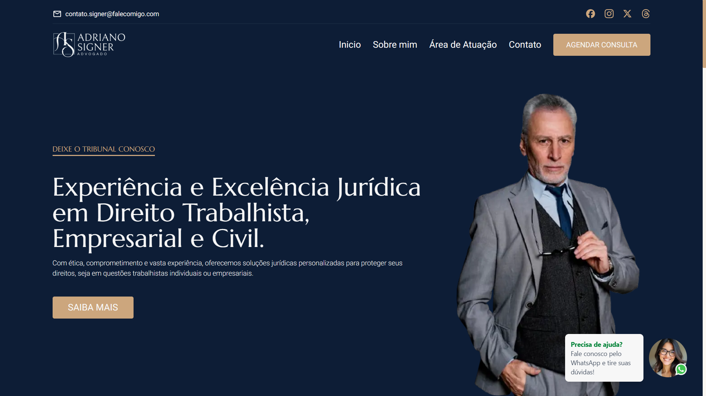

# Meu Advogado Online ⚖️

AdvogadoOnline é um site desenvolvido para conectar clientes a advogados de forma rápida e prática. A plataforma permite que usuários tirem dúvidas jurídicas diretamente pelo WhatsApp e enviem formulários por e-mail, garantindo um atendimento eficiente e acessível.

## Funcionalidades

- **Contato direto via WhatsApp 📞**
- **Envio de formulários por e-mail 📧**
- **Interface moderna e responsiva 💻📱**
- **Animações e transições suaves 🎞️**
- **Design intuitivo e profissional 🎨**

## Tecnologias Utilizadas:

- **React.js**: Para construção de interfaces interativas.
- **Next.js**: Para renderização do lado do servidor e otimização do desempenho.
- **Tailwind CSS**: Para estilização responsiva e design moderno.
- **Framer Motion**: Para animações dinâmicas e transições suaves.
- **EmailJS**: Para envio de formulários diretamente para o e-mail do administrador.
- **TypeScript**: Para tipagem estática e maior segurança no código.

Acesse o [site](https://meuadvogadoonline.vercel.app/).

## Authors

- [@lazaroalvesr](https://github.com/lazaroalvesr)

## 🔗 Links

